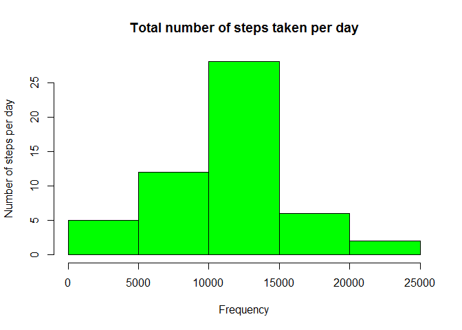
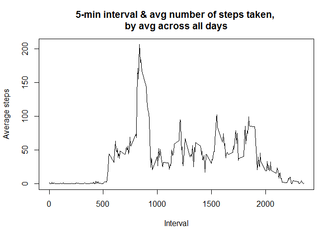
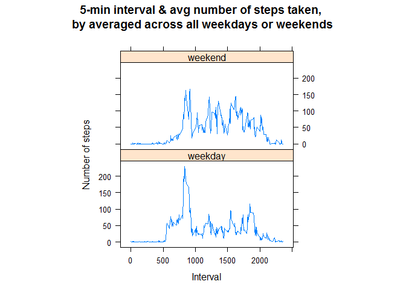

# Reproducible Research - Assignment 1
LBY  
October 18, 2015  

##**Introduction**

It is now possible to collect a large amount of data about personal movement using activity monitoring devices such as a Fitbit, Nike Fuelband, or Jawbone Up. These type of devices are part of the "quantified self" movement - a group of enthusiasts who take measurements about themselves regularly to improve their health, to find patterns in their behavior, or because they are tech geeks. But these data remain under-utilized both because the raw data are hard to obtain and there is a lack of statistical methods and software for processing and interpreting the data.

This assignment makes use of data from a personal activity monitoring device. This device collects data at 5 minute intervals through out the day. The data consists of two months of data from an anonymous individual collected during the months of October and November, 2012 and include the number of steps taken in 5 minute intervals each day.

##**Data**

The data for this assignment can be downloaded from the course web site:

Dataset: Activity monitoring data [52K]
The variables included in this dataset are:

- *steps: Number of steps taking in a 5-minute interval (missing values are coded as NA)*

- *date: The date on which the measurement was taken in YYYY-MM-DD format*

- *interval: Identifier for the 5-minute interval in which measurement was taken*

The dataset is stored in a comma-separated-value (CSV) file and there are a total of 17,568 observations in this dataset.

## **Analysis**

```r
library(knitr)
```

```
## Warning: package 'knitr' was built under R version 3.2.2
```

```r
#assumed the file is downloaded to the same directory as code
file<-"activity.csv"
myData<-read.csv(file,header=TRUE,sep=",")
#head(myData)
```

###What is mean total number of steps taken per day?
Histogram of the total number of steps taken each day

```r
myTotal<-aggregate(steps~date,myData,sum,na.rm=TRUE)
hist(myTotal$steps,xlab="Frequency",col="green",ylab="Number of steps per day",main="Total number of steps taken per day")
```

 

The mean of the total number of steps taken per day is

```r
myMean <- mean(myTotal$steps)
myMean
```

```
## [1] 10766.19
```

The median of the total number of steps taken per day is

```r
myMedian <- median(myTotal$steps)
myMedian
```

```
## [1] 10765
```

###What is the average daily activity pattern?
Time series plot (i.e. type = "l") of the 5-minute interval (x-axis) and the average number of steps taken, averaged across all days (y-axis)

```r
myIntervalsteps <- aggregate(steps ~ interval, myData, mean)
plot(steps ~ interval, data = myIntervalsteps, type = "l", xlab="Interval", ylab="Average steps", main="5-min interval & avg number of steps taken, \nby avg across all days")
```

 

Maximum number of steps on average across all the days for the 5-minute interval is

```r
myMaxInterval<-myIntervalsteps$interval[which.max(myIntervalsteps$steps)]
myMaxInterval
```

```
## [1] 835
```

###Imputing missing values
*Note that there are a number of days/intervals where there are missing values (coded as NA).*
*The presence of missing days may introduce bias into some calculations or summaries of the data.*

The total number of missing values is (i.e. the total number of rows with NAs)

```r
myNA<-sum(is.na(myData$steps))
myNA
```

```
## [1] 2304
```

Replacing missing values with mean for the day

```r
for (i in 1:nrow(myData)) {
  if (is.na(myData$steps[i])) {
    NAinterval <- myData$interval[i]
    row <- which(myIntervalsteps$interval == NAinterval)
    myData$steps[i] <- myIntervalsteps$steps[row]
  } 
}
myNewNA<-sum(is.na(myData$steps))
myNewNA
```

```
## [1] 0
```

Histogram of the total number of steps taken each day with filled missing values

```r
myNewTotal<-aggregate(steps~date,myData,sum)
hist(myTotal$steps,xlab="Frequency",col="green",ylab="Number of steps per day",main="Total number of steps taken per day")
```

 

The mean of the total number of steps taken per day is

```r
myNewMean <- mean(myNewTotal$steps)
myNewMean
```

```
## [1] 10766.19
```

The median of the total number of steps taken per day is

```r
myNewMedian <- median(myNewTotal$steps)
myNewMedian
```

```
## [1] 10766.19
```

The impact of replacing the missing values.

```r
print(paste("Mean is ",myMean,".New Mean is ",myNewMean,". Difference is ",myNewMean-myMean,"."))
```

```
## [1] "Mean is  10766.1886792453 .New Mean is  10766.1886792453 . Difference is  0 ."
```

```r
print(paste("Median is ",myMedian,".New Mean is ",myNewMedian,". Difference is ",myNewMedian-myMedian,"."))
```

```
## [1] "Median is  10765 .New Mean is  10766.1886792453 . Difference is  1.1886792452824 ."
```
The impact of replacing the missing values is insignificant.

###Are there differences in activity patterns between weekdays and weekends?
A new factor variable in the dataset with two levels - "weekday" and "weekend" indicating whether a given date is a weekday or weekend day.

```r
dayType<-c("Monday","Tuesday","Wednesday","Thursday","Friday")
myData$day<-ifelse(is.element(weekdays(as.Date(myData$date)),dayType),"weekday","weekend")
```

Panel plot containing a time series plot (i.e. type = "l") of the 5-minute interval (x-axis) and the average number of steps taken, averaged across all weekday days or weekend days (y-axis).

```r
myNewIntervalsteps <- aggregate(steps ~ interval + day, myData, mean)
library(lattice)
xyplot(steps ~ interval | factor(day), data = myNewIntervalsteps, aspect = 1/2, type = "l",
xlab="Interval",ylab="Number of steps",main="5-min interval & avg number of steps taken, \nby averaged across all weekdays or weekends")
```

 


